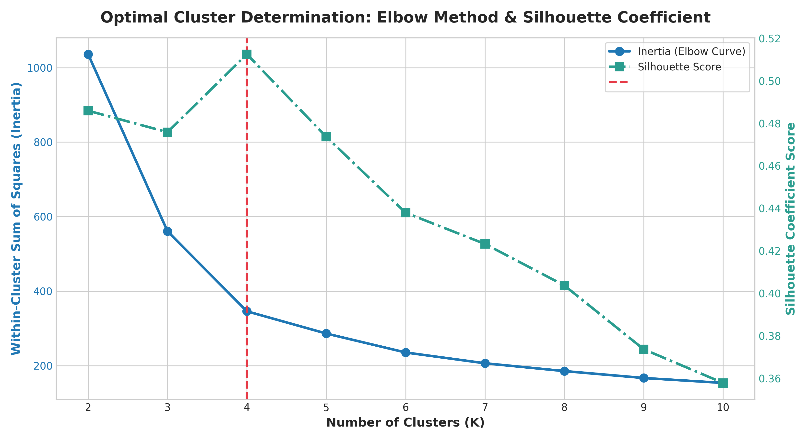
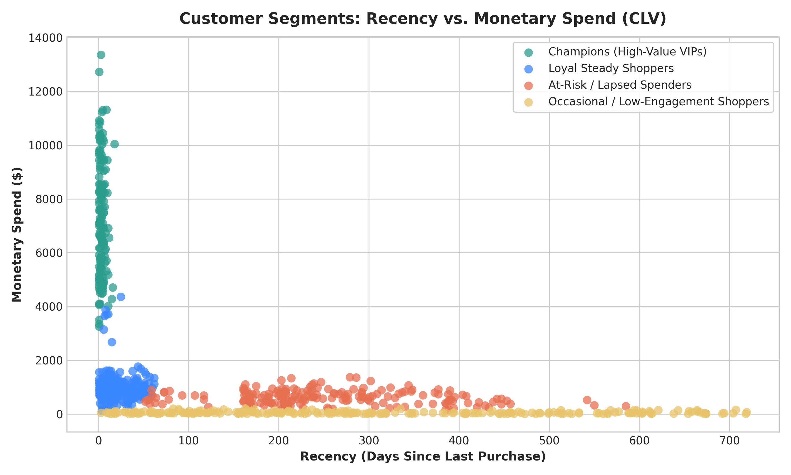
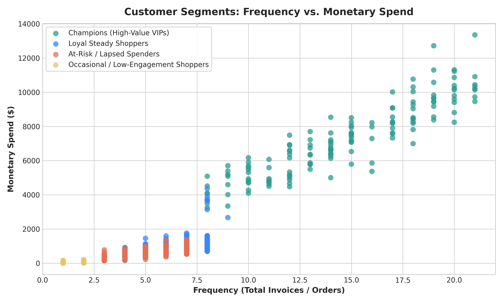
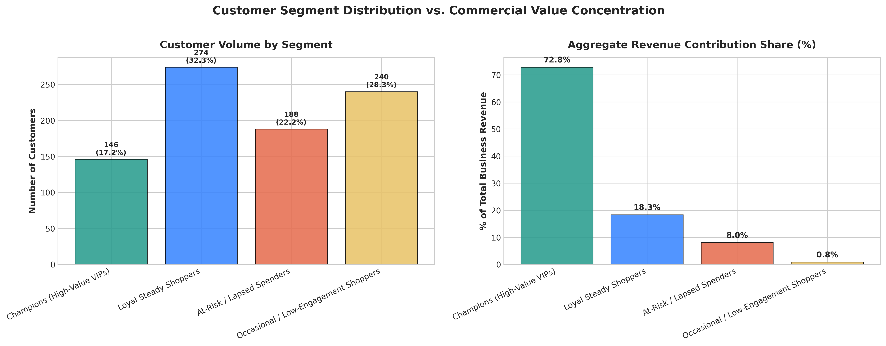

# 🛍️ Level 1 — Task 2: Customer Segmentation Analysis


---

## 📌 Project Overview & Metadata

- **Internship Program:** Oasis Infobyte SIP (Student Internship Program)
- **Intern Name:** Rajesh
- **Domain Track:** Data Analytics
- **Assigned Level:** Level 1
- **Task Number:** Task 2 — Customer Segmentation Analysis
- **Project Directory:** `OIBSIP/DataAnalytics-L1-CustomerSegmentation/`
- **GitHub Repository:** [OIBSIP- (rajeshrys)](https://github.com/rajeshrys/OIBSIP-.git)

### 🎯 Objective
Apply unsupervised Machine Learning clustering algorithms (**K-Means**) on an enterprise e-commerce transactional dataset using the behavioral **RFM (Recency, Frequency, Monetary)** framework. By segmenting the customer base into distinct cohorts based on purchasing velocity and monetary value, this project enables precision-targeted marketing strategies, maximizes Customer Lifetime Value (CLV), optimizes promotional budget allocation, and proactively mitigates customer churn.

---

## ✅ Feature Checklist

| Requirement | Description | Status |
| :--- | :--- | :---: |
| **Data Ingestion & Integrity Audit** | Load transactional log, inspect structure, remove guest checkouts and return cancellations | **Completed** |
| **Descriptive Statistics** | Calculate Average Purchase Value (AOV), Purchase Frequency, and Customer Lifetime Value (CLV) | **Completed** |
| **RFM Feature Engineering** | Derive Recency, Frequency, and Monetary metrics relative to snapshot date | **Completed** |
| **Data Normalization & Scaling** | Apply logarithmic transformation and `StandardScaler` to eliminate skewness and scale disparities | **Completed** |
| **Optimal Cluster Optimization** | Apply the Elbow Method (Inertia/WCSS) and Silhouette Score analysis for $K=2 \dots 10$ | **Completed** |
| **K-Means Model Execution** | Fit $K$-Means clustering ($K=4$) with `k-means++` initialization and seed reproducibility | **Completed** |
| **Multi-Dimensional Scatter Plots** | Visualize cluster boundaries across Recency vs. Monetary, Frequency vs. Monetary, and Recency vs. Frequency | **Completed** |
| **Quantitative Persona Profiling** | Calculate mean/median values per cluster and define descriptive personas | **Completed** |
| **Customer & Revenue Bar Charts** | Compare customer cohort population counts and aggregate commercial revenue contribution shares | **Completed** |
| **Targeted Marketing Strategies** | Provide data-driven executive playbooks tailored to each customer segment | **Completed** |

---

## 📂 Repository Structure

```text
DataAnalytics-L1-CustomerSegmentation/
├── data/
│   ├── ecommerce_transactions.csv          # Raw e-commerce transaction logs (26,340 rows)
│   ├── cleaned_transactions.csv            # Filtered, cleaned valid transactions (25,518 rows)
│   ├── descriptive_statistics.csv          # Central tendency, dispersion, and skewness metrics
│   ├── cluster_profiles.csv                # Quantitative metrics and revenue shares per cluster
│   └── rfm_segmented_customers.csv         # Individual customer RFM scores with cluster assignments
├── visualizations/
│   ├── 01_elbow_and_silhouette_analysis.png
│   ├── 02_rfm_distributions_before_after_scaling.png
│   ├── 03_cluster_scatter_recency_monetary.png
│   ├── 04_cluster_scatter_frequency_monetary.png
│   ├── 05_cluster_scatter_recency_frequency.png
│   ├── 06_customer_distribution_per_cluster.png
│   └── 07_cluster_profiles_rfm_comparison.png
├── Customer_Segmentation_Analysis.ipynb    # Fully executed Jupyter Notebook with inline outputs
├── customer_segmentation.py               # Standalone end-to-end Python pipeline
├── generate_dataset.py                    # Dataset generator creating realistic e-commerce logs
├── build_notebook.py                      # Automated notebook generation script
└── README.md                             # Comprehensive project documentation
```

---

## 📊 Dataset Schema & Data Dictionary

The analysis was performed across **26,340 raw transactions** spanning from **January 6, 2023 to December 30, 2024**:

| Column Name | Data Type | Description |
| :--- | :--- | :--- |
| `InvoiceNo` | `object` | 6-digit unique transaction identifier (prefixed with 'C' for cancellations) |
| `StockCode` | `object` | Unique alphanumeric product item SKU |
| `Description` | `object` | Commercial product catalog name |
| `Quantity` | `int64` | Units purchased per transaction line (negative values denote cancellations/returns) |
| `InvoiceDate` | `datetime64` | Timestamp when the transaction was executed |
| `UnitPrice` | `float64` | Unit price in USD ($) |
| `CustomerID` | `float64` | Unique customer entity identifier (null values represent guest checkouts) |
| `Country` | `object` | Customer domicile country |

### Data Cleaning Summary:
1. **Guest Checkout Removal:** 658 records (2.50%) lacked registered `CustomerID`s and were excluded from customer-level RFM aggregation.
2. **Cancellations & Returns:** 164 records with negative quantities or 'C' invoice prefixes were pruned.
3. **Valid Analytical Corpus:** 25,518 completed transactions representing **848 distinct customer entities**.

---

## 📐 RFM Analytical Framework & Descriptive Statistics

For each unique customer entity, three core behavioral metrics were engineered using a snapshot date set one day following the final transaction (`2024-12-31 18:49:00`):

1. **Recency ($R$):** Elapsed days between the customer's most recent completed order and the snapshot date.
2. **Frequency ($F$):** Total number of distinct invoices/orders executed by the customer.
3. **Monetary ($M$):** Aggregate net gross spend generated by the customer (Customer Lifetime Value).

### Descriptive Statistical Summary:

| Metric | Mean | Median | Std Dev | Min | Max | Skewness |
| :--- | :---: | :---: | :---: | :---: | :---: | :---: |
| **Recency (Days)** | 147.65 | 49.50 | 178.85 | 1.00 | 719.00 | +1.27 |
| **Frequency (Orders)** | 6.10 | 5.00 | 4.75 | 1.00 | 21.00 | +1.34 |
| **Monetary ($ Spend)** | $1,720.68 | $707.88 | $2,724.34 | $0.83 | $13,352.36 | +2.03 |
| **Average Order Value ($)** | $171.00 | $125.03 | $162.65 | $0.83 | $669.38 | +1.33 |
| **Customer Lifetime Value ($)** | $1,720.68 | $707.88 | $2,724.34 | $0.83 | $13,352.36 | +2.03 |

> [!NOTE]
> All raw RFM features exhibit substantial positive skewness (skewness > +1.2), indicating a long right tail of elite high-frequency and high-monetary customers. To prevent Euclidean distance distortion during clustering, normalization was necessary.

---

## ⚙️ Data Preprocessing & Cluster Optimization

### 1. Skewness Rectification & Standardization
To stabilize variance and conform to Gaussian-like geometry, features were transformed:
$$\tilde{X} = \ln(1 + X)$$
Subsequently, each dimension was standardized using `StandardScaler` ($Z = \frac{x - \mu}{\sigma}$) to guarantee equal mathematical weighting during distance calculations.

### 2. Hyperparameter Tuning: Elbow Method & Silhouette Score
We assessed cluster validity from $K=2$ to $K=10$:

| Clusters ($K$) | Within-Cluster Sum of Squares (Inertia) | Silhouette Coefficient |
| :---: | :---: | :---: |
| 2 | 1,036.00 | 0.4859 |
| 3 | 560.87 | 0.4758 |
| **4** | **345.98** | **0.5125 (Optimal Peak)** |
| 5 | 286.34 | 0.4737 |
| 6 | 235.48 | 0.4380 |
| 7 | 206.45 | 0.4233 |
| 8 | 185.51 | 0.4037 |

**Decision:** $K=4$ was selected as the optimal cluster count, corresponding simultaneously to the primary geometric "elbow" inflection point and the absolute global maximum **Silhouette Score (0.5125)**.

---

## 👥 Customer Segment Profiles & Quantitative Archetypes

| Cluster | Segment Persona | Customer Count | % Customer Base | Avg Recency | Avg Frequency | Avg Monetary Spend | Total Segment Revenue | % Total Revenue |
| :---: | :--- | :---: | :---: | :---: | :---: | :---: | :---: | :---: |
| **3** | **Champions (High-Value VIPs)** | 146 | **17.2%** | **3.9 days** | **14.7 orders** | **$7,279.99** | $1,062,878.53 | **72.8%** |
| **1** | **Loyal Steady Shoppers** | 274 | **32.3%** | **20.6 days** | **6.3 orders** | **$974.83** | $267,103.01 | **18.3%** |
| **0** | **At-Risk / Lapsed Spenders** | 188 | **22.2%** | **251.9 days** | **5.0 orders** | **$622.15** | $116,963.63 | **8.0%** |
| **2** | **Occasional / Casual Shoppers** | 240 | **28.3%** | **298.5 days** | **1.5 orders** | **$50.79** | $12,189.90 | **0.8%** |

---

## 📈 Visual Analytics & Key Observations

### 1. Optimal Cluster Determination (Elbow & Silhouette)

- **Observation:** The WCSS curve drops sharply from $K=2$ to $K=4$, flattening noticeably beyond $K=4$. The Silhouette score peaks decisively at $K=4$ (0.5125), confirming high intra-cluster cohesion and clean separation.

### 2. Recency vs. Monetary Spend

- **Observation:** Champions cluster tightly at the upper-left quadrant (Recency < 15 days, Monetary > $3,000). At-Risk customers cluster horizontally across the right-hand side (Recency > 180 days, moderate spend), representing prime reactivation opportunities.

### 3. Frequency vs. Monetary Spend

- **Observation:** Demonstrates a strong exponential relationship between order count and total customer spend. Champions stand out distinctly with 8–21 orders and up to $13,000+ in spend.

### 4. Customer Volume vs. Revenue Concentration

- **Commercial Takeaway (Pareto Principle):** Just **17.2% of customers (Champions)** generate **72.8% of aggregate corporate revenue** ($1.06M out of $1.46M). Conversely, 28.3% of the customer base consists of one-time or occasional shoppers contributing under 1% of revenue.

---

## 🚀 Targeted Executive Marketing Playbook

### 💎 Segment 1: Champions (High-Value VIPs) — 17.2% Customers | 72.8% Revenue
- **Target Goal:** Maximize retention, advocate brand prestige, and protect margins.
- **Recommended Actions:**
  1. **Concierge Experience:** Provide dedicated phone/chat support lines and complimentary priority shipping.
  2. **VIP Pre-Release Access:** Offer exclusive 48-hour access windows to limited-edition inventory.
  3. **Zero Margin Dilution:** Avoid sending generic percentage discounts; reward instead with branded physical merchandise and experiential perks.

### 🌟 Segment 2: Loyal Steady Shoppers — 32.3% Customers | 18.3% Revenue
- **Target Goal:** Expand Average Order Value (AOV) and elevate to VIP tier.
- **Recommended Actions:**
  1. **Threshold Upselling:** Implement conditional incentives (*"Add $20 more to unlock free express delivery and a complimentary product"*).
  2. **Personalized Cross-Selling:** Deploy automated recommendations based on collaborative item filtering.
  3. **Milestone Rewards:** Deliver celebratory badges and points bonuses on their 5th and 10th orders.

### ⚠️ Segment 3: At-Risk / Lapsed Spenders — 22.2% Customers | 8.0% Revenue
- **Target Goal:** Win-back lapsed high-value customers and identify churn drivers.
- **Recommended Actions:**
  1. **Automated 3-Stage Win-Back Sequence:** Trigger personalized "We Miss You" email journeys at Day 180, 210, and 240 featuring dynamic discounts ($15 store credit).
  2. **One-Click Diagnostic Survey:** Embed a single-question survey asking why they paused orders (pricing, delivery time, customer service, or product fit).

### 🌱 Segment 4: Occasional / Low-Engagement Shoppers — 28.3% Customers | 0.8% Revenue
- **Target Goal:** Drive second-order conversion and establish recurring purchase habits.
- **Recommended Actions:**
  1. **Post-Purchase Nurture Funnel:** Automated 14-day sequence highlighting top customer reviews, FAQs, and unboxing tips.
  2. **Urgency-Driven Second Purchase Voucher:** Send a 10% coupon valid for 7 days post-delivery to overcome second-order inertia.

---

## 💻 How to Run Locally

```bash
# Clone the repository
git clone https://github.com/rajeshrys/OIBSIP-.git
cd OIBSIP-/DataAnalytics-L1-CustomerSegmentation

# Run the dataset generator
python generate_dataset.py

# Run the complete segmentation pipeline
python customer_segmentation.py

# Or launch Jupyter Notebook to inspect interactive cells
jupyter notebook Customer_Segmentation_Analysis.ipynb
```

---
*Developed by **Rajesh** as part of the **Oasis Infobyte Student Internship Program (OIBSIP)** — Domain: Data Analytics.*
