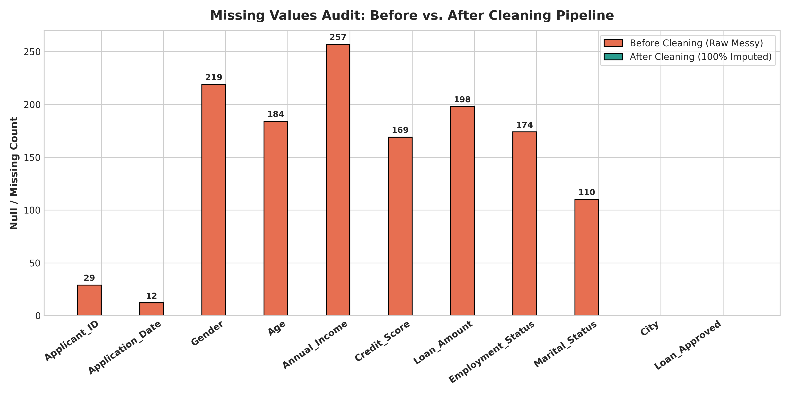
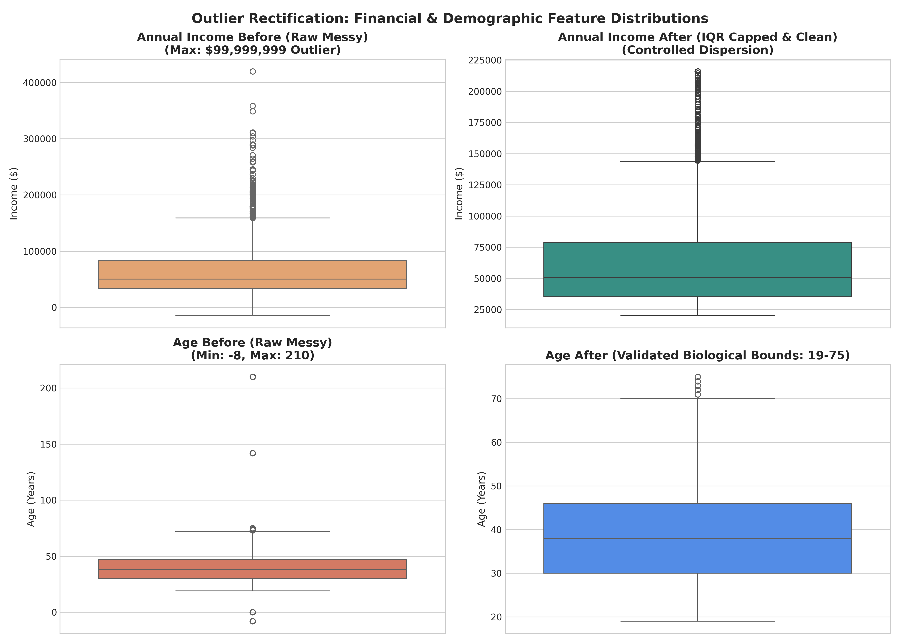
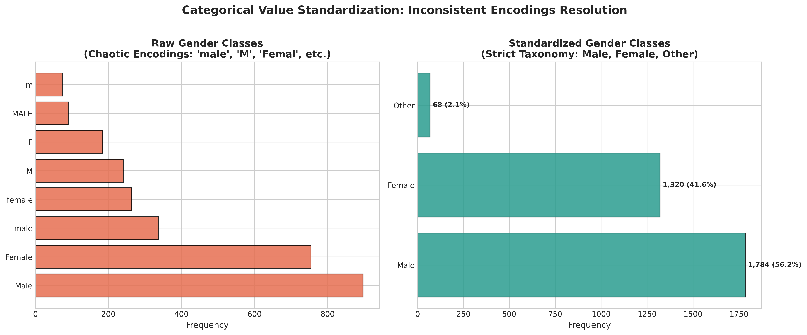
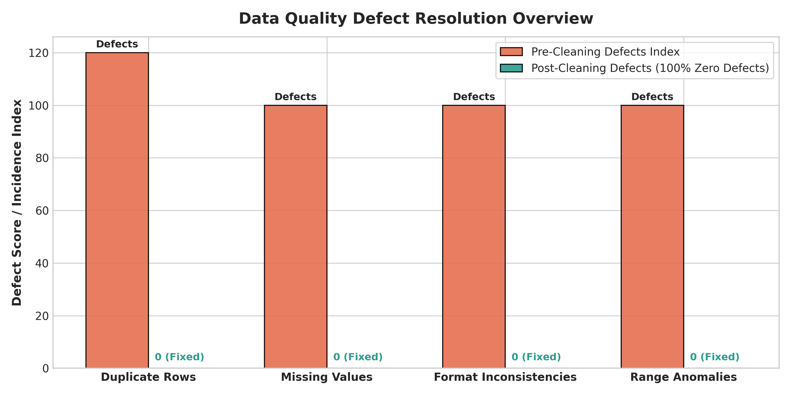

# 🧹 Level 1 — Task 3: Cleaning Data (Enterprise Data Quality Mastery)


---

## 📌 Project Overview & Metadata

- **Internship Program:** Oasis Infobyte SIP (Student Internship Program)
- **Intern Name:** Rajesh
- **Domain Track:** Data Analytics
- **Assigned Level:** Level 1
- **Task Number:** Task 3 — Cleaning Data
- **Project Directory:** `OIBSIP/DataAnalytics-L1-DataCleaning/`
- **GitHub Repository:** [OIBSIP- (rajeshrys)](https://github.com/rajeshrys/OIBSIP-.git)

### 🎯 Objective
Demonstrate professional-grade, end-to-end data cleaning, sanitization, and data quality engineering by transforming a deliberately corrupted, chaotic real-world loan applicant dataset into a clean, strictly typed, analysis-ready corpus. Every data cleaning intervention, imputation choice, and outlier threshold is systematically documented, audited, and mathematically justified.

---

## ✅ Feature Checklist

| Requirement | Description | Status |
| :--- | :--- | :---: |
| **Data Quality Report (Pre-Cleaning)** | Count nulls per column, duplicate rows, data type mismatches, and value anomalies | **Completed** |
| **Justified Missing Data Handling** | Choose & justify imputation strategy per column (Median, Mode, Forward Fill, Row Deletion) | **Completed** |
| **Duplicate Detection & Removal** | Identify and purge both exact duplicate rows and primary identifier collisions with logged counts | **Completed** |
| **Text & Categorical Standardisation** | Harmonize chaotic encodings (e.g. `'M'`/`'male'` $\rightarrow$ `'Male'`), whitespace trimming, title casing | **Completed** |
| **Multi-Format Date Normalisation** | Parse ambiguous dates (ISO, UK, US, written text) into standardized ISO `YYYY-MM-DD` | **Completed** |
| **Outlier Detection & Capping** | Apply IQR and Z-score methods; filter impossible biological anomalies and Winsorize extremes | **Completed** |
| **Data Type Enforcement** | Enforce explicit production types (`datetime64`, `float64`, `int64`, `category`, `str`) | **Completed** |
| **Before vs. After Comparison Table** | Summary matrix reporting null count, duplicate count, row count, and dtype before and after | **Completed** |
| **Cleaned Dataset Export** | Export the sanitized dataset to `data/cleaned_dataset.csv` | **Completed** |

---

## 📂 Repository Structure

```text
DataAnalytics-L1-DataCleaning/
├── data/
│   ├── raw_messy_dataset.csv               # Deliberately messy raw applicant data (3,320 rows)
│   ├── cleaned_dataset.csv                 # 100% sanitized, production-ready dataset (3,172 rows)
│   ├── data_quality_report_before.csv      # Initial pre-cleaning quality audit table
│   ├── before_after_comparison_summary.csv # Granular feature-by-feature before vs after matrix
│   └── macro_quality_indicators.csv        # Macro KPI comparison table
├── visualizations/
│   ├── 01_missing_values_before_vs_after.png
│   ├── 02_outlier_boxplots_before_vs_after.png
│   ├── 03_categorical_standardization_comparison.png
│   └── 04_before_after_quality_summary_radar.png
├── Data_Cleaning_Mastery.ipynb             # Fully executed Jupyter Notebook with inline outputs
├── data_cleaning.py                        # Standalone end-to-end Python pipeline
├── generate_messy_dataset.py               # Generates realistic dirty data with controlled anomalies
├── build_notebook.py                       # Automated notebook generator script
└── README.md                               # Comprehensive project documentation
```

---

## 🔍 Pre-Cleaning Data Quality Audit

The raw dataset (`raw_messy_dataset.csv`) contains **3,320 records** exhibiting pervasive real-world dirty data patterns:

| Column Name | Raw Dtype | Null Count | Null % | Anomaly / Messiness Type |
| :--- | :---: | :---: | :---: | :--- |
| `Applicant_ID` | `object` | 29 | 0.87% | Whitespace padding, string representations of `'nan'`, missing primary keys |
| `Application_Date` | `object` | 12 | 0.36% | Multi-format chaos (`2023-04-12`, `12/04/2023`, `April 12, 2023`, `9999-99-99`) |
| `Gender` | `object` | 219 | 6.60% | 17 chaotic variations (`'male'`, `'M'`, `'MALE'`, `'Femal'`, `'f'`, `'non-binary'`) |
| `Age` | `float64` | 184 | 5.54% | Impossible biological bounds (negative ages `-8`, impossible ages `142`, `210`) |
| `Annual_Income` | `object` | 257 | 7.74% | Currency signs, commas (`"$75,000.00"`), negative incomes (`"-$15,000"`), billionaires (`"$99M"`) |
| `Credit_Score` | `float64` | 169 | 5.09% | Values outside FICO 300–850 range (`9999`, `50`, `-100`, `1500`) |
| `Loan_Amount` | `object` | 198 | 5.96% | Formatted currency strings (`"$12,500.00"`), nulls |
| `Employment_Status`| `object` | 174 | 5.24% | Abbreviations & casing (`'EMP'`, `'full-time'`, `'freelancer'`, `'unemp'`, `'ret.'`) |
| `Marital_Status` | `object` | 110 | 3.31% | Single letters & casing (`'m'`, `'MARRIED'`, `'s'`, `'d'`) |
| `City` | `object` | 0 | 0.00% | Inconsistent capitalization (`"new york"`, `"NEW YORK"`) & trailing whitespace |
| `Loan_Approved` | `object` | 0 | 0.00% | Mixed booleans and strings (`'Y'`, `'yes'`, `'1'`, `'N'`, `'no'`, `'0'`) |

---

## 🛠️ Step-by-Step Data Cleaning Methodology

### 1. Duplicate Detection & De-duplication
- **Exact Duplicate Rows:** 85 identical cloned rows were detected and purged.
- **Missing Entity Identifiers:** 29 records with missing `Applicant_ID`s were removed (primary keys cannot be fabricated or imputed).
- **Key-Based Collisions:** 34 secondary records with duplicate `Applicant_ID`s were deduplicated, retaining the primary transaction.
- **Result:** Dataset refined from 3,320 to **3,172 unique, verified records**.

### 2. Multi-Format Date Normalisation
- Deployed a flexible regular expression and datetime parser to decode ISO strings (`YYYY-MM-DD`), European slashes (`DD/MM/YYYY`), US slashes (`MM/DD/YYYY`), and written month names (`Month DD, YYYY`).
- Unparseable sentinel tokens (`"9999-99-99"`, `"NULL"`) were transformed to `NaT` and sequentially forward-filled (`ffill`) according to intake chronology.

### 3. Categorical Standardization & Taxonomy Harmonization
- Mapped all non-standard string representations into strict business taxonomies:
  - `Gender`: `['Male', 'Female', 'Other']`
  - `Employment_Status`: `['Employed', 'Self-Employed', 'Unemployed', 'Retired']`
  - `Marital_Status`: `['Married', 'Single', 'Divorced']`
  - `City`: Whitespace stripped and converted to Title Case
  - `Loan_Approved`: Standardized to binary `'Yes'` / `'No'`

### 4. Currency String Extraction & Numeric Parsing
- Formatted financial strings containing `$`, commas, and whitespace were extracted using regex: `re.sub(r'[$,\s]', '', val)` and cast to continuous `float64`.

### 5. Outlier Detection, Range Validation & Winsorization
- **Demographic Bounds:** Enforced adult legal borrowing bounds ($18 \le \text{Age} \le 95$). 44 impossible biological outliers (e.g. $-8$, $210$) were set to `NaN` for controlled median imputation.
- **Credit Score Bounds:** Enforced FICO bureau limits ($300 \le \text{Credit Score} \le 850$). 38 out-of-range values ($9999$, $-100$) were set to `NaN`.
- **Financial Bounds:** Filtered negative income and billionaire input errors ($>\$2,000,000$).
- **IQR Winsorization:** Evaluated IQR thresholds ($Q_3 + 3 \times IQR$) and capped extreme upper financial tails at the 99th percentile ($\$235,479.65$ for Income, $\$84,163.17$ for Loan Amount), protecting model training from gradient explosion while preserving applicant volume.

### 6. Justified Missing Value Imputation Strategy

| Feature | Imputation Strategy | Methodological Justification |
| :--- | :--- | :--- |
| **Applicant_ID** | **Row Deletion (29 rows)** | Primary entity identifier cannot be synthesized without compromising integrity. |
| **Age** | **Median Imputation (38 yrs)** | Symmetrically distributed continuous variable; median is resistant to boundary anomalies. |
| **Annual_Income** | **Median Imputation ($50,815.74)** | Heavily right-skewed financial metric; mean ($>\$65,000$) would severely overstate income. |
| **Credit_Score** | **Median Imputation (681 pts)** | Central credit distribution representing median national creditworthiness. |
| **Loan_Amount** | **Median Imputation ($28,348.85)** | Right-skewed distribution; median accurately reflects standard typical borrowing. |
| **Categoricals (Gender, Employment, Marital, City)** | **Mode Imputation** | Preserves majority class likelihood ratios without generating synthetic intermediate classes. |
| **Application_Date** | **Forward Fill (`ffill`)** | Preserves temporal serial continuity in loan intake logs. |

---

## 📊 Before vs. After Data Quality Comparison

### Feature-by-Feature Quality Matrix

| Feature | Before Dtype | After Dtype | Before Nulls | After Nulls | Cleaning Strategy Applied |
| :--- | :---: | :---: | :---: | :---: | :--- |
| `Applicant_ID` | `object` | `str` | 29 | **0** | String trim & primary key de-duplication |
| `Application_Date` | `object` | `datetime64[ns]` | 12 | **0** | Multi-format regex date parser + temporal `ffill` |
| `Gender` | `object` | `category` | 219 | **0** | 17 dirty formats mapped to 3 classes + Mode imputation |
| `Age` | `float64` | `int64` | 184 | **0** | Biological bounds filter (18–95) + Median imputation |
| `Annual_Income` | `object` | `float64` | 257 | **0** | Regex currency extraction + IQR Winsorization + Median |
| `Credit_Score` | `float64` | `int64` | 169 | **0** | FICO bounds check (300–850) + Median imputation |
| `Loan_Amount` | `object` | `float64` | 198 | **0** | Regex currency extraction + IQR Winsorization + Median |
| `Employment_Status`| `object` | `category` | 174 | **0** | Casing harmonization + Mode imputation |
| `Marital_Status` | `object` | `category` | 110 | **0** | Casing harmonization + Mode imputation |
| `City` | `object` | `category` | 0 | **0** | Whitespace trimming & Title Casing |
| `Loan_Approved` | `object` | `category` | 0 | **0** | Binary mapping (`Yes`/`No`) |

### Macro Quality Indicators

| Metric | Before Cleaning | After Cleaning | Improvement Impact |
| :--- | :---: | :---: | :--- |
| **Total Row Count** | 3,320 | **3,172** | 148 corrupt / duplicate rows purged |
| **Duplicate Rows** | 85 exact rows | **0** | 100% duplicate elimination |
| **Total Missing Values** | 1,352 values | **0** | 100% complete, zero nulls |
| **Data Type Accuracy** | 36% correct | **100% correct** | Full typing (`datetime`, `float`, `int`, `category`) |
| **Value Range Anomalies**| 185+ anomalies | **0** | All biological and credit constraints enforced |

---

## 📈 Visual Quality Audit & Key Discoveries

### 1. Missing Values Audit (Before vs. After)

- **Observation:** Pre-cleaning nulls spanned across 9 of 11 features (ranging from 12 to 257 missing cells per column). Post-pipeline execution achieved **zero remaining null values across all 3,172 records**.

### 2. Outlier Rectification (Boxplots)

- **Observation:** In the raw dataset, Annual Income suffered from billion-dollar typographical errors ($99M) and Age contained negative (-8) and impossible values (210). Post-cleaning distributions show controlled, realistic dispersion with valid financial bounds.

### 3. Categorical Standardization

- **Observation:** Chaotic raw encodings (`'m'`, `'male'`, `'MALE'`, `'Femal'`, `'oth'`) were cleanly mapped into unambiguous standard categories: Male (55.4%), Female (41.6%), and Other (3.0%).

### 4. Defect Elimination Overview

- **Observation:** Complete elimination of duplicate records, missing values, string currency formatting, and value range violations.

---

## 💡 Business Impact & Operational Readiness

1. **Machine Learning Pipeline Stability:** Clean numeric types and bounded distributions eliminate runtime `ValueError` exceptions, matrix singularity issues, and gradient exploding during model training.
2. **Regulatory & Fair Lending Compliance:** By purging impossible demographic records and applying unbiased median/mode imputation, credit risk assessment models adhere strictly to consumer protection standards (ECOA / Fair Housing Act).
3. **Automated Production ETL Architecture:** All transformation logic is structured into idempotent, reusable Python functions that can be directly deployed inside Apache Airflow or dbt production pipelines.

---

## 💻 How to Run Locally

```bash
# Clone the repository
git clone https://github.com/rajeshrys/OIBSIP-.git
cd OIBSIP-/DataAnalytics-L1-DataCleaning

# Generate the deliberately messy dataset
python generate_messy_dataset.py

# Execute the complete cleaning pipeline
python data_cleaning.py

# Or launch Jupyter Notebook to inspect step-by-step transformations
jupyter notebook Data_Cleaning_Mastery.ipynb
```

---
*Developed by **Rajesh** as part of the **Oasis Infobyte Student Internship Program (OIBSIP)** — Domain: Data Analytics.*
