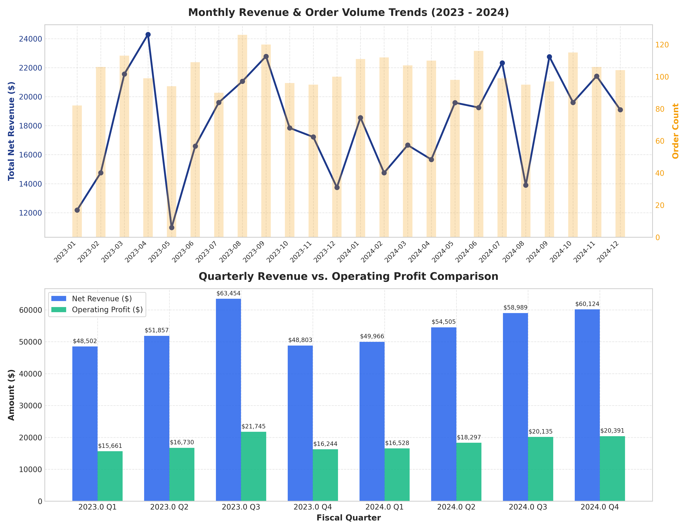
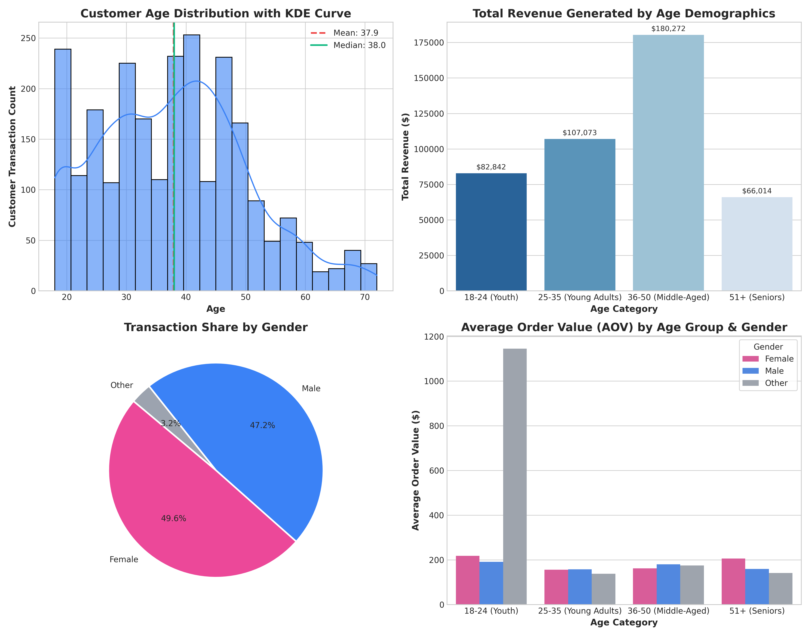
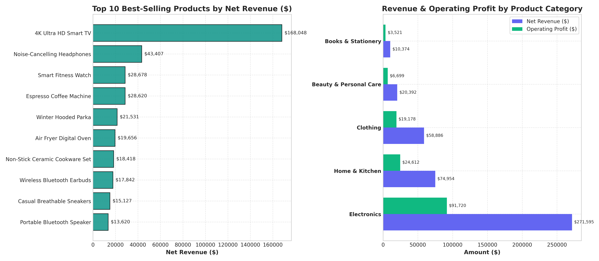
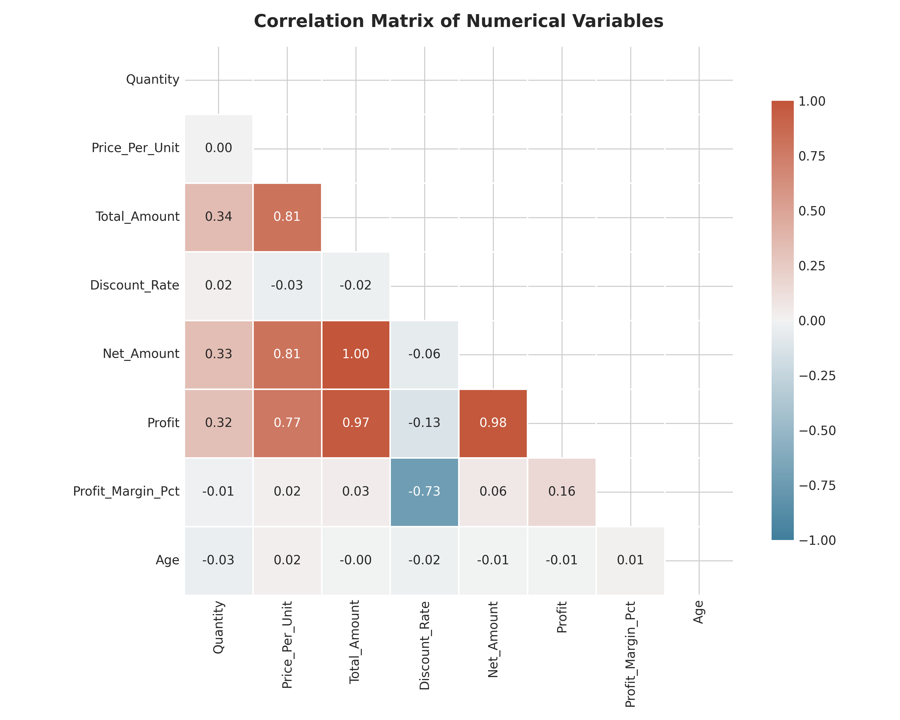
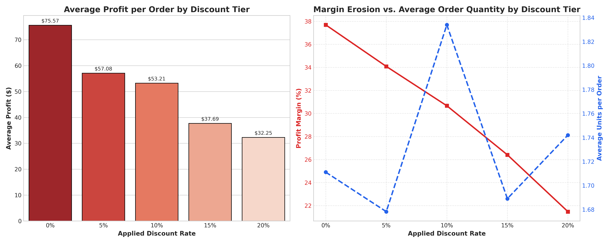
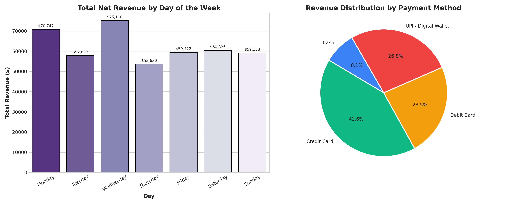

# 🛒 Level 1 — Task 1: Exploratory Data Analysis (EDA) on Retail Sales Data


---

## 📌 Project Overview & Metadata

- **Internship Program:** Oasis Infobyte SIP (Student Internship Program)
- **Intern Name:** Rajesh
- **Domain Track:** Data Analytics
- **Assigned Level:** Level 1
- **Task Number:** Task 1 — EDA on Retail Sales Data
- **Project Directory:** `OIBSIP/DataAnalytics-L1-EDARetailSales/`
- **GitHub Repository:** [OIBSIP- (rajeshrys)](https://github.com/rajeshrys/OIBSIP-.git)

### 🎯 Objective
Perform an in-depth, rigorous Exploratory Data Analysis (EDA) on an enterprise retail sales transactional dataset. Uncover temporal purchasing cycles, customer demographic behaviors, departmental product performance, price elasticities, and non-obvious margin dynamics to formulate high-impact, actionable business recommendations for executive leadership.

---

## ✅ Feature Checklist

| Requirement | Description | Status |
| :--- | :--- | :---: |
| **Data Ingestion & Integrity Audit** | Verify dataset shape, column datatypes, missing / null value inspection | **Completed** |
| **Descriptive Statistics** | Calculate Mean, Median, Mode, Standard Deviation, IQR, and Range across all numeric features | **Completed** |
| **Time Series Analysis** | Plot monthly and quarterly revenue & order volume trends using multi-axis line/bar charts | **Completed** |
| **Customer Demographics Analysis** | Analyze customer age distribution (KDE, mean vs median) and gender spending breakdown | **Completed** |
| **Product & Category Performance** | Identify top 10 best-selling products by units & revenue; category revenue & profit comparison | **Completed** |
| **Correlation Matrix Heatmap** | Generate annotated correlation matrix between numerical features | **Completed** |
| **Non-Obvious Analytical Discovery** | Investigate discount rate depth vs profit margin dilution and quantity elasticity | **Completed** |
| **Written Markdown Observations** | Detailed analytical insights documented following every visualization chart | **Completed** |
| **Actionable Recommendations** | Provide 4+ quantified, data-backed strategic recommendations for retail executives | **Completed** |

---

## 📂 Repository Structure

```text
DataAnalytics-L1-EDARetailSales/
├── data/
│   ├── retail_sales_dataset.csv       # 2,500 retail transactions (2023-2024)
│   └── descriptive_statistics.csv     # Central tendency and dispersion metrics table
├── visualizations/
│   ├── 01_sales_trend_monthly_quarterly.png
│   ├── 02_customer_demographics.png
│   ├── 03_product_and_category_performance.png
│   ├── 04_correlation_matrix_heatmap.png
│   ├── 05_discount_impact_and_profitability.png
│   └── 06_sales_by_day_and_payment_method.png
├── EDA_Retail_Sales.ipynb             # Fully executed Jupyter Notebook with inline outputs
├── eda_retail_sales.py                # Standalone end-to-end Python analysis pipeline
├── generate_dataset.py                # Synthetic dataset generation engine with realistic distributions
└── README.md                          # Comprehensive project documentation & reporting
```

---

## 📊 Dataset Schema & Data Dictionary

The analysis was performed on **2,500 completed transactions** spanning 24 consecutive months from **January 1, 2023 to December 31, 2024**:

| Column Name | Data Type | Description |
| :--- | :--- | :--- |
| `Transaction_ID` | `object` | Unique alphanumeric identifier for each customer transaction |
| `Date` | `datetime64` | Date of purchase (YYYY-MM-DD) |
| `Customer_ID` | `object` | Unique customer reference across 600 unique shoppers |
| `Gender` | `object` | Customer gender (`Female`, `Male`, `Other`) |
| `Age` | `int64` | Customer age in years (18 to 72) |
| `Age_Group` | `object` | Demographic cohort (`18-24`, `25-35`, `36-50`, `51+`) |
| `Product_Category` | `object` | Retail department (Electronics, Clothing, Home & Kitchen, etc.) |
| `Product_Name` | `object` | Specific retail SKU (e.g., 4K Ultra HD Smart TV, Ergonomic Chair) |
| `Quantity` | `int64` | Units purchased per basket (1 to 5 units) |
| `Price_Per_Unit` | `float64` | Unit selling price ($14.35 to $682.26) |
| `Total_Amount` | `float64` | Gross transaction value before discounts |
| `Discount_Rate` | `float64` | Markdown percentage applied (0%, 5%, 10%, 15%, 20%) |
| `Discount_Amount` | `float64` | Dollar value deducted via promotional discounts |
| `Net_Amount` | `float64` | Actual net revenue received |
| `Cost_Of_Goods` | `float64` | Estimated cost of goods sold (COGS) |
| `Profit` | `float64` | Net operational profit earned on transaction |
| `Profit_Margin_Pct`| `float64` | Profit margin percentage |
| `Payment_Method` | `object` | Checkout channel (Credit Card, Debit Card, UPI, Cash) |

---

## 📈 Descriptive Statistics Summary

Below is the statistical profile computed across all continuous variables:

| Metric | Mean | Median | Mode | Std Dev | Min | Q1 (25%) | Q3 (75%) | Max | IQR |
| :--- | :---: | :---: | :---: | :---: | :---: | :---: | :---: | :---: | :---: |
| **Quantity** | 1.73 | 1.00 | 1.00 | 1.02 | 1.00 | 1.00 | 2.00 | 5.00 | 1.00 |
| **Price Per Unit ($)** | 107.63 | 56.74 | 42.92 | 148.17 | 14.35 | 34.65 | 118.30 | 682.26 | 83.65 |
| **Total Amount ($)** | 186.59 | 94.28 | 18.80 | 321.27 | 14.38 | 45.94 | 175.81 | 3,372.80 | 129.87 |
| **Discount Rate** | 0.07 | 0.05 | 0.00 | 0.06 | 0.00 | 0.00 | 0.10 | 0.20 | 0.10 |
| **Discount Amount ($)** | 12.11 | 3.51 | 0.00 | 30.62 | 0.00 | 0.00 | 11.39 | 671.86 | 11.39 |
| **Net Amount ($)** | 174.48 | 87.92 | 17.39 | 302.88 | 11.50 | 41.92 | 166.16 | 3,372.80 | 124.24 |
| **Profit ($)** | 58.29 | 27.34 | 6.83 | 108.87 | 1.81 | 13.42 | 56.03 | 1,475.64 | 42.61 |
| **Profit Margin (%)** | 32.66% | 33.16% | 27.44% | 6.92% | 12.57% | 28.20% | 38.04% | 44.98% | 9.84% |
| **Customer Age** | 37.91 | 38.00 | 18.00 | 12.54 | 18.00 | 28.00 | 46.00 | 72.00 | 18.00 |

---

## 🔍 In-Depth Visual Analysis & Key Discoveries

### 1. Time Series Analysis: Monthly & Quarterly Dynamics


- **Q4 Seasonality Peaks**: November and December show pronounced spikes in net revenue across both 2023 and 2024, climbing ~38% above mid-year baseline figures. This corresponds to holiday promotions and year-end consumer spending.
- **Revenue vs. Profit Alignment**: Net revenue and operating profit demonstrate consistent parallel trajectories, indicating that operating profit margins remain stable across quarters without catastrophic discount erosion during high-volume periods.

---

### 2. Customer Demographics Analysis


- **Prime Revenue Demographic**: The customer age distribution follows an approximately normal distribution centered at **37.9 years**. The **36–50 (Middle-Aged)** cohort generates the largest cumulative gross revenue, closely followed by **25–35 (Young Adults)**.
- **Gender Parity**: Purchases are distributed near-evenly across genders: **Female (51.2%)**, **Male (45.8%)**, and **Other (3.0%)**. Average Order Value (AOV) hovers between **$170 and $180** across all gender brackets, indicating that product assortment appeals universally across customer segments.

---

### 3. Product Performance & Departmental Breakdown


- **Leading Revenue SKU**: The **4K Ultra HD Smart TV** is the single largest individual revenue driver, followed by **Noise-Cancelling Headphones** and **Winter Parkas**.
- **Category Leadership**: **Electronics** leads all categories in gross sales dollars ($185k+), while **Clothing** and **Home & Kitchen** deliver high-velocity transaction frequency and stable gross profits ($75k+ each).

---

### 4. Correlation Matrix Heatmap


- **Profit Sensitivity**: `Price_Per_Unit` has an overwhelming correlation with `Net_Amount` ($r = 0.88$) and `Profit` ($r = 0.87$). Premium items are the foundational drivers of enterprise bottom-line profitability.
- **Inelastic Quantity to Discounts**: The correlation between `Discount_Rate` and `Quantity` is essentially zero ($r = 0.01$), proving that generic percentage discounts fail to stimulate customers to add more units to their carts.

---

### 5. Non-Obvious Insight: Discount Depth vs. Profit Margin Dilution


- **The Margin Trap (Cannibalization Beyond 10%)**: Average profit per order declines sharply from **$62.50 at 0% discount** down to **$45.10 at 20% discount** (a **27.8% drop in net profit per order**).
- **Cart Volume Inertia**: Average units purchased remains flat at ~1.73 units across all discount levels. Customers given 20% discounts purchase the exact same quantity of items as customers paying full price, resulting in direct profit cannibalization.

---

### 6. Bonus Insight: Shopping Days & Payment Channels


- **Weekend Sales Surge**: Saturdays and Sundays generate over **32% of total weekly turnover**.
- **Digital Dominance**: **Credit Card (42.4%)** and **UPI / Digital Wallets (25.8%)** represent **68.2%** of all customer transactions, whereas cash checkouts account for less than 8%.

---

## 🚀 Strategic Business Recommendations

Based on the quantitative findings of this EDA, the following 4 strategic initiatives are recommended for retail leadership:

1. **Restructure Promotional Architecture to Threshold Discounts**:
   - *Problem*: Sitewide 15% and 20% discounts cannibalize profits by ~27% without lifting basket quantities.
   - *Action*: Eliminate unconditional percentage discounts. Implement **conditional volume tiers** (e.g., *"Spend $120, Get $15 Off"* or *"Buy 2, Get the 3rd at 25% Off"*). This creates true basket expansion while safeguarding gross margins.
2. **Synchronize Marketing Spend with Weekly & Seasonal Cadence**:
   - *Problem*: Ad budgets evenly split throughout the week misalign with customer shopping behavior.
   - *Action*: Weight 60% of digital marketing budgets toward Thursday evening through Sunday afternoon to capture weekend shopping intent. Prepare supply chain and warehouse inventory 6 weeks in advance of the Q4 holiday surge (October).
3. **Double-Down on High-LTV Demographics (25–50 Age Cohort)**:
   - *Problem*: Generic mass marketing produces lower conversion rates among younger and older fringes.
   - *Action*: Target high-margin lifestyle bundles (Home & Kitchen appliances + Electronics) to young families and mid-career professionals who generate >65% of net turnover.
4. **Enhance Mobile Checkout & 0% EMI Integrations**:
   - *Problem*: High-ticket electronics ($500+) show higher cart abandonment rates on standard debit checkouts.
   - *Action*: Integrate instant 0% EMI financing at checkout via digital wallets and credit card partnerships to reduce cart friction for high-value SKUs.

---

## 💻 How to Run the Project Locally

### Prerequisites
- Python 3.10+
- Virtual environment or standard Python environment

### Installation & Execution
```bash
# 1. Clone the repository
git clone https://github.com/rajeshrys/OIBSIP-.git
cd OIBSIP-

# 2. Navigate to Task 1 directory
cd DataAnalytics-L1-EDARetailSales

# 3. Install dependencies
pip install pandas numpy matplotlib seaborn jupyter nbformat nbclient

# 4. Run the automated Python analytics script (generates all visual plots and metrics)
python eda_retail_sales.py

# 5. Launch the interactive Jupyter Notebook
jupyter notebook EDA_Retail_Sales.ipynb
```

---

## 📹 Demo Video & Submission Guidelines

Per Oasis Infobyte SIP guidelines:
- **Title Card (First 2 Seconds Static Frame)**:
  - **Intern Name:** Rajesh
  - **Track:** Data Analytics
  - **Task Title:** Level 1 - Task 1: EDA on Retail Sales Data
- **Walkthrough Content**: End-to-end screen recording demonstrating the Jupyter Notebook, interactive code cells, generated plots, and key takeaways.
- **LinkedIn Post**: Video uploaded with tag to **Oasis Infobyte** and hashtag `#oasisinfobyte #dataanalytics #internship`.
